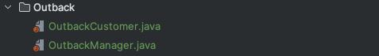

# 2장 의미 있는 이름(Meaningful Names)

2장은 개발 과정에서 클래스, 메서드, 변수명 등 어떤 '명칭'이 올바른지 제시해주고 있다.

### 의미 있는 이름?
개발 과정에서의 다양한 곳에서 개발자가 직접 이름을 명시하면서 개발을 하고 있다.\
수 많은 이름을 붙혀줘야 하는데 귀찮고, 바쁘니까 '의미 없는 이름'을 붙혀주고 있다면 그것이 나쁜 코드의 시작이다.\
2장을 읽으면서, 의미 있는 이름은 이것이 정답이다. 라는 느낌보다 여러가지 올바른 방법을 제시하고 있는데, 알아보도록 하자.

### 1. 의도를 분명히 밝혀라.
의도를 분명히 하는 변수명을 짓는데 고민하는 시간이 아까워도 투자해야 한다.\
➡️ 그 이름을 정하므로 추후 절약하는 시간이 더 많기 때문입니다.

- 예시1) 의도가 분명하지 않은 코드
```java
int d; // 경과 시간(단위: 날짜)
```

- 예시1) 의도가 분명한 코드
```java
int elapsedTimeInDays;
int daysSinceModification;
int daySinceCreation;
int fileAgeInDays;
```
위 처럼 경과 시간의 뜻이 잘 담긴 변수명을 사용하니 의도가 분명해졌다.

<br>

- 예시2) 의도가 분명하지 않은 코드
```java
public List<int[]> getThem() {
    List<int[]> list1 = new ArrayList();
    
    for (int[] x : theList)
        if (x[0] == 4)
            list1.add(x);
    
    return list1;
}
```

- 예시2) 의도가 분명한 코드
```java
public List<Cell> getFlaggedCells() {
    List<Cell> flaggedCells = new ArrayList();

    for (Cell cell : gameBoard)
        if (cell.isFlagged())
            flaggedCells.add(cell);

    return flaggedCells
}
```
의도가 올바르지 않는 경우는 값을 보더라도 어떤 의미인지 알지 못한다.\
하지만 의도가 담긴 변수명을 보면 정확히는 모르지만 해당 로직이 무슨 기능을 하는지는 짐작이 가능하다.

<br>

### 2. 그릇된 정보를 피하라.
- 예시1) 널리 쓰이는 의미가 있는 단어를 다른 의미로 사용하지 말자
```java
int hp = 3;
```
hp 를 보면 게임에서 사용하는 HP 인지, 컴퓨터 제조사 HP 인지 알지 못한다.\
이처럼 널리 쓰이고 있는 단어를 피해서 사용해보도록 하자.

- 예시2) List
```java
String[] alphabetList = {"a", "b", "c"};
```
변수명에 List를 넣으려면 진짜 타입이 List인 경우에만 넣는게 좋다.\
Collection인 경우 alphabets 처럼 's'를 붙혀서 복수로 붙혀주는게 좋다.

- 예시3) 비슷해보이는 문자를 쓰지말자
```java
int a = 1;

if (O == l) a = 0l;
else 1 = 01;
```
당연한 얘기지만 소문자 l <-> 숫자 1, 대문자 O <-> 숫자 0 과 같이 헷갈리는 문자는 쓰지 말아야 한다.

<br>

### 3. 의미 있게 구분해라.
읽는 사람이 차이를 알도록 이름을 지어야한다.
- 예시1)
```java
productInfo vs productData
getActiveAccount() vs getActiveAccountInfo()
moneyAmount vs money
customerInfo vs customer
```
위와 같은 변수가 각각 있을 경우 어떤 차이가 있는지 알 수가 없다. (의미있게 구분해야한다.)

<br>

### 4. 인코딩을 피하라.
- 예시1) 헝가리식 표현법
```java
phoneString, nameString, moneyLong
```
변수명에 타입이 들어가면 타입이 변경되어도 이름이 바뀌지 않기 때문에 착오를 일으킬 수 있다.

- 예시2) 인터페이스 클래스와 구현체 클래스
```java
ShapeFactory (interface 클래스)
        
IShapeFactory : X
ShapeFactoryImpl : O
CShapeFactory : O
```

<br>

### 5. 클래스 이름
클래스 이름은 명사나 명사구가 적합하다.
```html
Customer, WikiPage, Account
```

<br>

### 6. 메서드 이름
메서드 이름은 동사나 동사구가 적합하다.
```html
getName, postPayment, deletePage, save, calculate
```

<br>

### 7. 한 개념에 한 단어를 사용하라.
- 예시) 제각각 부른 올바르지 않은 명칭
```html
getMember, fetchMember, retrieveMember
```
위처럼 get, fetch, retrieve 전부 가져오는 의미이지만 혼란스럽기 때문에 통일해서 사용하는 것이 바람직하다.

<br>

### 8. 말장난을 하지 마라.
위 7번 '한 개념에 한 단어를 사용하라'라는 규칙을 적용해보자. \
더하거나 새로운 값을 만드는 의미로 메소드를 add 라고 정했을 때,\
개념이 조금 다른 리스트 메소드를 add 라고 한다면 그것이 말장난이다. (insert, append 가 어울린다.)

<br>

### 9. 해법 영역에서 가져온 이름을 사용하라.
개발자간 주로 사용하는 디자인 패턴에서 나오는 단어를 사용하는 것이 좋다.
- 예시)
```html
AccountVisitor, JobQueue
```

### 10. 도메인 영역에서 가져온 이름을 사용하라.
위 9번 해법 영역에서 쓸 단어가 없을 경우 도메인 영역에서 사용하는 단어를 사용하는 것이 좋다.
- 예시)
```html
seller, buyer
```

### 11. 의미 있는 맥락을 추가하라.
- 예시1) 불명확한 변수명
```java
public class AddressMaker {
    private String name;
    private String zipCd;
    private String addr1;
    private String addr2;
    
    public String[] getAddress() {
        return new String[]{name, zipCd, addr1, addr2};
    }
}
```
- 예시2) 명확한 변수명
```java
public class AddressMaker {
    private Address address;
 
    public Address getAddress() {
        return address;
    }
}
```
예시 1 같은경우 하나의 주소를 만들 때 AddressMaker 안에 있는 변수를 전부 사용하기 때문에,\
예시 2 처럼 Address 클래스로 묶어서 사용하는 것이 좋다.

### 12. 불필요한 맥락을 없애라.
Outback 이라는 패키지에 고객과 매니저를 추가하는 클래스를 만든다고 가정해보자.


위처럼 OutbackCustomer, OutbackManager 보다 Customer, Manager 라고 사용하는게 훨씬 적절하다.\
불필요한 맥락 제거로 읽기 더 수월하다.

<br>

### 느낀점
개발하면서 귀찮다고 넘겼던 클래스, 변수명 등을 해당 장을 읽으면서 다시 반성하게 되었습니다.\
또한 앞으로는 개발을 하는 것도 중요하지만, 명칭 짓는 시간을 더 투자해야한다고 생각하게 되었습니다.